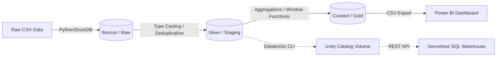

# RetailInsights — SQL & Power BI Business Analytics

## Dashboard Preview


## Project Overview
RetailInsights is an end-to-end data analytics project built to analyze e-commerce performance. It showcases advanced SQL analytical querying, a Python-based ETL pipeline, a simplified Medallion-style architecture (Raw → Staging → Curated), and a business-facing Power BI dashboard.

## Business Problem
The project aims to answer critical strategic questions for an e-commerce marketplace:
1. Is revenue growth accelerating or decelerating?
2. Which states and product categories are driving the highest revenue?
3. Where are the biggest operational inefficiencies (delivery delays)?
4. What does customer retention (cohort drop-off) look like month-over-month?
5. Who are the most valuable customers, and who is at risk of churning?

## The Dataset
This project uses the [Olist Brazilian E-Commerce Public Dataset](https://www.kaggle.com/datasets/olistbr/brazilian-ecommerce), containing approximately 100,000 anonymized orders from 2016 to 2018. The data spans 9 related datasets covering orders, customers, products, sellers, payments, reviews, and geolocation.

## Tech Stack
* **Analytics & Data Modeling:** Advanced SQL (Window Functions, CTEs, Aggregations)
* **Business Intelligence (BI):** Power BI
* **Data Engineering & ETL:** Python (`pandas`), DuckDB (in-process OLAP database)
* **Cloud Execution Proof-of-Concept:** Databricks CLI, Databricks Serverless SQL Warehouse, REST API
* **Version Control:** Git

---

## ETL & Data Cleaning

The pipeline uses Python and DuckDB to process the raw CSVs into clean tables:
* **Ingestion:** 9 raw `.csv` datasets loaded directly into a `raw` schema.
* **Cleaning & Normalization:** 
  * String dates cast to `TIMESTAMP` objects for accurate date math.
  * Floating-point coercion for financial metrics.
  * Review deduplication using `ROW_NUMBER() OVER(PARTITION BY...)` to ensure one review per order.

---

## SQL Analysis & Techniques Used

The Curated / Gold analytical layer relies on 6 advanced SQL scripts (located in `/sql/`) that heavily utilize window functions and CTEs:

* `01_mom_revenue_growth.sql`: Uses the **`LAG()` window function** to calculate month-over-month revenue growth.
* `02_customer_rfm.sql`: Uses the **`NTILE(4)` window function** and multi-level aggregations to score customers across Recency, Frequency, and Monetary tiers to identify VIPs vs. Churn Risks.
* `03_top_categories_by_region.sql`: Uses **`RANK() OVER (PARTITION BY...)`** to find the top 3 revenue-driving product categories per state.
* `04_delivery_delay_analysis.sql`: Uses **`DATE_DIFF()` and `CASE` statements** to calculate operational inefficiencies by mapping estimated vs. actual delivery dates.
* `05_cohort_retention.sql`: A **multi-CTE** query establishing the first-purchase month and calculating customer drop-off in subsequent months.
* `06_payment_preferences.sql`: Uses **`CASE` bucketing** to analyze payment behaviors across different order value tiers.

---

## Key Business Findings

1. **Revenue Deceleration:** After explosive growth throughout 2017, revenue plateaued and contracted in early 2018. *Recommendation: Evaluate targeted retention and LTV strategies alongside aggressive new-customer acquisition.*
2. **Severe Post-Purchase Churn:** Cohort analysis shows low retention following a customer's first purchase month. *Recommendation: Investigate targeted second-purchase and CRM lifecycle strategies to establish buying habits.*
3. **Regional Dominance:** The state of São Paulo (SP) drastically outpaces all other states in gross revenue. *Recommendation: Identify this as a concentration risk and monitor diversification opportunities in secondary states like RJ and MG.*
4. **The Delivery Bottleneck:** States like AL and MA experience delivery delay rates of 17-21%. *Recommendation: Investigate carrier performance, fulfillment coverage, and delivery SLAs in these regions to identify potential operational improvements.*

*(See `business_findings.md` for the full executive summary).*

---

## Architecture

The project utilizes a simplified Medallion-style architecture:



1. **Bronze (Raw):** Ingestion of raw datasets.
2. **Silver (Staging):** Cleaned, typed, and deduplicated tables.
3. **Curated / Gold analytical layer:** Heavy aggregations built for BI consumption. Exported to `.csv` files to power the Power BI dashboard directly, ensuring fast visual rendering.

---

## Cloud Execution Proof-of-Concept (Databricks)

While DuckDB powers the local pipeline for rapid iteration, this project includes a Cloud Execution Proof-of-Concept using **Databricks Serverless** (Databricks SQL). 

I orchestrated the cloud infrastructure programmatically using the Databricks CLI and REST API (headless execution):
1. Authenticated the Databricks CLI via Personal Access Token (PAT).
2. Uploaded local staging tables to a Unity Catalog Volume.
3. Spun up a Serverless SQL Warehouse via the API and created tables using `read_files()`.
4. Executed the heavy RFM Segmentation query remotely and saved the JSON payload back to local disk (`databricks_rfm_output.json`).

---

## Project Structure

```text
RetailInsightsBusinessAnalytics/
├── .gitignore
├── README.md
├── business_findings.md              # Executive summary of insights
├── dashboard/
│   ├── RetailPulse_Dashboard.pbix    # Power BI file
│   └── data/                         # Curated CSVs powering the dashboard
├── notebooks/
│   ├── 01_data_cleaning.py           # Exploratory script
│   ├── 02_duckdb_pipeline.py         # Automates Raw → Staging architecture
│   ├── 03_sql_analysis.py            # Executes analytical queries and exports Gold layer
│   └── 04_export_for_databricks.py   # Prep script for cloud upload
├── sql/                              # The 6 core analytical SQL queries
├── databricks_upload.ps1             # CLI script for Unity Catalog volume upload
└── databricks_cli_poc.ps1            # Headless execution of RFM query on Serverless SQL
```

---

## Setup & Run Instructions

1. Clone the repository.
2. Ensure you have Python installed, then install dependencies: `pip install duckdb pandas`
3. Download the [Olist E-Commerce Dataset from Kaggle](https://www.kaggle.com/datasets/olistbr/brazilian-ecommerce) and place the `.csv` files in a `/data/` folder in the root directory (this folder is ignored by git).
4. Run `cd notebooks` followed by `python 02_duckdb_pipeline.py` to build the local DuckDB data warehouse.
5. Run `python 03_sql_analysis.py` to execute the SQL queries and generate the curated `.csv` files for Power BI.
6. Open `dashboard/RetailPulse_Dashboard.pbix` in Power BI Desktop and click Refresh to load the data.

## Limitations & Future Improvements
* **BI Aggregations:** Currently, Power BI utilizes default aggregations on the flat curated tables. Future iterations should implement a true Star Schema (Fact/Dimension tables) with explicit DAX measures for greater analytical flexibility.
* **Orchestration:** The Python scripts are currently run sequentially/manually. Implementing an orchestrator such as Apache Airflow or dbt would provide proper DAG dependency management and failure retries.
* **Data Quality Checks:** Adding additional data-quality assertions (e.g., checking for nulls or negative revenue) between pipeline stages would improve robustness.
