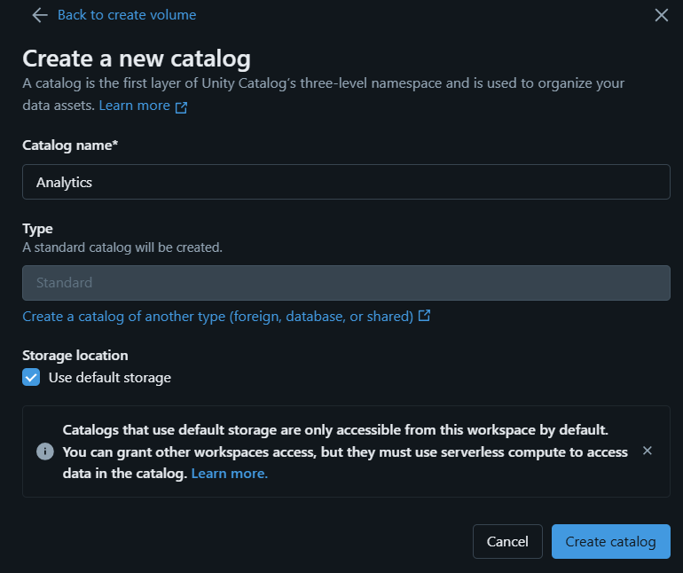

# Retail Data Warehouse — E-Commerce Analytics Data Pipeline



## 📌 Project Overview
Retail Data Warehouse is an end-to-end data engineering and analytics project built to analyze 100,000+ real e-commerce orders from the Olist dataset. It showcases a modern **Medallion Data Architecture (Raw → Staging → Curated)**, advanced SQL analytical queries, a fully automated Python ETL pipeline, and a business-facing Power BI dashboard.

## 🎯 Business Problem
The project aims to answer critical strategic questions for an e-commerce marketplace:
1. Is revenue growth accelerating or decelerating?
2. Which states and product categories are driving the highest revenue?
3. Where are the biggest operational inefficiencies (delivery delays)?
4. What does customer retention (cohort drop-off) look like month-over-month?
5. Who are the most valuable customers, and who is at risk of churning?

## 🛠️ Tech Stack
* **Data Engineering & ETL:** Python (`pandas`), DuckDB (in-process OLAP database)
* **Cloud Execution Proof-of-Concept:** Databricks CLI, Databricks Serverless SQL Warehouse, REST API
* **Analytics & Data Modeling:** Advanced SQL (Window Functions, CTEs, Aggregations)
* **Business Intelligence (BI):** Power BI
* **Version Control:** Git

---

## 🏗️ Data Architecture

The project utilizes a modern **Medallion Architecture**:

1. **Bronze (Raw):** Ingestion of 9 raw `.csv` datasets directly into DuckDB.
2. **Silver (Staging):** Data cleaning and normalization in Python/SQL.
   * String dates cast to `TIMESTAMP` objects.
   * Floating-point coercion for financial metrics.
   * Review deduplication using `ROW_NUMBER() OVER(PARTITION BY...)`.
3. **Gold (Curated):** Heavy analytical aggregations built for BI consumption. These are exported back to `.csv` files to power the Power BI dashboard directly, ensuring fast visual rendering without re-querying the database.

---

## 📊 SQL Analysis & Techniques Used

The curated "Gold" layer relies on 6 advanced SQL scripts (located in `/sql/`):

* `01_mom_revenue_growth.sql`: Uses the **`LAG()` window function** to calculate Month-over-Month percentage changes in total order volume.
* `02_customer_rfm.sql`: Uses the **`NTILE(4)` window function** and multi-level aggregations to score customers across Recency, Frequency, and Monetary tiers to identify VIPs vs. Churn Risks.
* `03_top_categories_by_region.sql`: Uses **`RANK() OVER (PARTITION BY...)`** to find the top 3 revenue-driving product categories per state.
* `04_delivery_delay_analysis.sql`: Uses **`DATE_DIFF()` and `CASE` statements** to calculate operational inefficiencies by mapping estimated vs. actual delivery dates.
* `05_cohort_retention.sql`: A **multi-CTE** query establishing the first-purchase month and calculating the customer drop-off in subsequent months.
* `06_payment_preferences.sql`: Uses **`CASE` bucketing** to analyze payment behaviors across different order value tiers.

---

## 📈 Key Business Findings

1. **Revenue Deceleration:** After explosive growth throughout 2017, revenue plateaued and contracted in early 2018. The strategy must pivot from aggressive acquisition to maximizing the Lifetime Value (LTV) of the existing base.
2. **Severe Post-Purchase Churn:** Cohort analysis shows near-zero retention following a customer's first purchase month. An automated CRM lifecycle campaign targeting the second purchase is critical.
3. **Regional Dominance:** The state of São Paulo (SP) drastically outpaces all other states in gross revenue. The business is heavily over-indexed on a single state, presenting a concentration risk.
4. **The Delivery Bottleneck:** States like AL and MA experience delivery delay rates of 17-21%. Renegotiating Service Level Agreements (SLAs) with carriers in these states is required to prevent bad reviews and churn.

*(See `business_findings.md` for the full executive summary).*

---

## ☁️ Cloud Execution Proof-of-Concept (Databricks)

While DuckDB powers the local pipeline for rapid iteration, this project includes a proof-of-concept for cloud scalability using **Databricks Serverless**. 

I orchestrated the cloud infrastructure programmatically using the Databricks CLI and REST API (headless execution):
1. Authenticated the Databricks CLI via Personal Access Token (PAT).
2. Uploaded local staging tables to a **Unity Catalog Volume**.
3. Spun up a **Serverless SQL Warehouse** via the API and created tables using `read_files()`.
4. Executed the heavy RFM Segmentation query remotely and saved the JSON payload back to local disk (`databricks_rfm_output.json`).

---

## 📂 Project Structure

```text
retail-data-warehouse/
├── .gitignore
├── README.md
├── business_findings.md              # Executive summary of insights
├── dashboard_preview.png             # Dashboard screenshot
├── dashboard/
│   ├── RetailPulse_Dashboard.pbix    # Power BI file
│   └── data/                         # Curated CSVs powering the dashboard
├── notebooks/
│   ├── 01_data_cleaning.py           # Exploratory script
│   ├── 02_duckdb_pipeline.py         # Automates Raw -> Staging architecture
│   ├── 03_sql_analysis.py            # Executes analytical queries and exports Gold layer
│   └── 04_export_for_databricks.py   # Prep script for cloud upload
├── sql/                              # The 6 core analytical SQL queries
├── databricks_upload.ps1             # CLI script for Unity Catalog volume upload
└── databricks_cli_poc.ps1            # Headless execution of RFM query on Serverless SQL
```

---

## 🚀 Setup & Run Instructions

1. Clone the repository.
2. Ensure you have Python installed, then install dependencies: `pip install duckdb pandas`
3. Download the [Olist E-Commerce Dataset from Kaggle](https://www.kaggle.com/datasets/olistbr/brazilian-ecommerce) and place the `.csv` files in a `/data/` folder in the root directory (this folder is `.gitignore`'d).
4. Run `cd notebooks` followed by `python 02_duckdb_pipeline.py` to build the local DuckDB data warehouse.
5. Run `python 03_sql_analysis.py` to execute the SQL queries and generate the curated `.csv` files for Power BI.
6. Open `dashboard/RetailPulse_Dashboard.pbix` in Power BI Desktop and click **Refresh** to load the data.

## ⚠️ Limitations & Future Improvements
* **BI Aggregations:** Currently, Power BI utilizes default aggregations on the flat curated tables. Future iterations should implement a true Star Schema (Fact/Dimension tables) with explicit DAX measures for greater flexibility.
* **Orchestration:** The Python scripts are currently run manually sequentially. Implementing Apache Airflow or Mage.ai would provide proper DAG orchestration and failure retries.
* **Data Quality Checks:** Adding assertions (e.g., checking for nulls or negative revenue) between pipeline stages would improve robustness.
